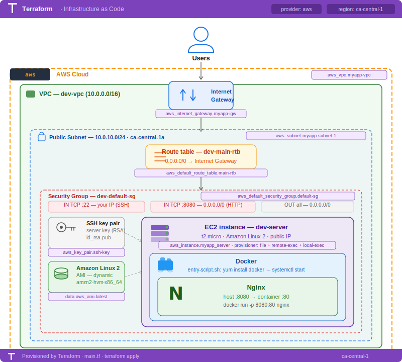
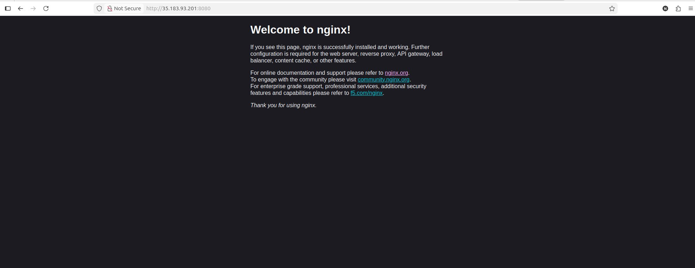
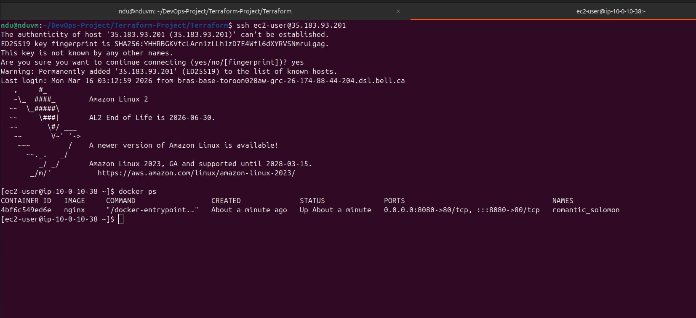

# 🚀 AWS Nginx Docker Deployment

> Infrastructure as Code with Terraform — deploys a Dockerized Nginx web server on AWS EC2 in the `ca-central-1` region.


---

## 📋 Overview

This project provisions a complete AWS infrastructure using **Terraform** to deploy an **Nginx web server** running inside a **Docker container** on an Amazon EC2 instance. All networking, security, compute, and application bootstrapping are fully automated — a single `terraform apply` brings everything up from scratch.

**What gets deployed:**
- An isolated **VPC** with a public subnet
- An **Internet Gateway** and route table for public internet access
- A **Security Group** with SSH (your IP only) and HTTP (port 8080) access
- An **EC2 t2.micro** instance running Amazon Linux 2
- **Docker + Nginx** installed and started automatically via a bootstrap script

---

## 🏗️ Architecture



---

## ✅ Deployment Screenshots

### Nginx running in the browser



### Docker container confirmed on the EC2 instance



> Nginx container `romantic_solomon` is up, mapped on `0.0.0.0:8080->80/tcp` — fully operational.

---

## 📁 Project Structure

```
.
├── main.tf                   # All Terraform resource definitions
├── terraform.tfvars          # Your variable values — DO NOT COMMIT
├── terraform.tfvars.example  # Safe placeholder template to commit
├── entry-script.sh           # Bootstrap script executed on EC2 after launch
├── architecture.svg          # Infrastructure architecture diagram
├── nginx-welcome.png         # Screenshot — Nginx running in browser
└── docker-ps.png             # Screenshot — Docker container on EC2
```

---

## ⚠️ Before You Start — Protect Sensitive Files

**Never commit `terraform.tfvars` to version control.** It contains your IP address and SSH key paths.

Add the following to your `.gitignore`:

```gitignore
# Terraform sensitive files
terraform.tfvars
*.tfstate
*.tfstate.*
.terraform/
.terraform.lock.hcl
output.txt
```

Instead, commit a **`terraform.tfvars.example`** file with placeholder values only.

---

## ✅ Prerequisites

| Tool | Version | Purpose |
|------|---------|---------|
| [Terraform](https://developer.hashicorp.com/terraform/downloads) | >= 1.3.0 | Infrastructure provisioning |
| [AWS CLI](https://aws.amazon.com/cli/) | >= 2.x | AWS authentication & credentials |
| SSH Key Pair | RSA / Ed25519 | Secure access to the EC2 instance |
| AWS Account | — | Target environment for all resources |

> **IAM permissions required:** EC2, VPC, Subnets, Internet Gateway, Route Tables, Security Groups, Key Pairs.

---

## ⚙️ Configuration Variables

Copy the example file and fill in your own values:

```bash
cp terraform.tfvars.example terraform.tfvars
```

**`terraform.tfvars.example`** — commit this, not the real file:

```hcl
vpc_cidr_blocks      = "10.0.0.0/16"
subnet_cidr_block    = "10.0.10.0/24"
avail_zone           = "ca-central-1a"
env_prefix           = "dev"
my_ip                = "YOUR.PUBLIC.IP.ADDRESS/32"
instance_type        = "t2.micro"
public_key_location  = "/path/to/your/.ssh/id_rsa.pub"
private_key_location = "/path/to/your/.ssh/id_rsa"
```

> **Tip:** Run `curl ifconfig.me` in your terminal to find your current public IP for the `my_ip` field.

| Variable | Example Value | Description |
|----------|--------------|-------------|
| `vpc_cidr_blocks` | `10.0.0.0/16` | CIDR block for the entire VPC (65,536 IPs) |
| `subnet_cidr_block` | `10.0.10.0/24` | CIDR block for the public subnet (256 IPs) |
| `avail_zone` | `ca-central-1a` | AWS Availability Zone for subnet and EC2 |
| `env_prefix` | `dev` | Tag prefix for all named resources (e.g. `dev-vpc`) |
| `my_ip` | `YOUR.PUBLIC.IP.ADDRESS/32` | Your IP — only this address can SSH into the server |
| `instance_type` | `t2.micro` | EC2 instance size (free-tier eligible) |
| `public_key_location` | `/path/to/.ssh/id_rsa.pub` | Path to your local SSH public key |
| `private_key_location` | `/path/to/.ssh/id_rsa` | Path to your local SSH private key |

---

## 🧩 Terraform Resources

### Networking

| Resource | Name | Description |
|----------|------|-------------|
| `aws_vpc` | `dev-vpc` | Isolated virtual network (`10.0.0.0/16`) |
| `aws_subnet` | `dev-subnet-1` | Public subnet in `ca-central-1a` (`10.0.10.0/24`) |
| `aws_internet_gateway` | `dev-igw` | Enables internet access for the VPC |
| `aws_default_route_table` | `dev-main-rtb` | Routes all traffic (`0.0.0.0/0`) through the IGW |

### Security Group Rules

| Direction | Port | Source | Purpose |
|-----------|------|--------|---------|
| Inbound | `22` | Your IP only (`/32`) | SSH management |
| Inbound | `8080` | `0.0.0.0/0` | Public HTTP access |
| Outbound | All | `0.0.0.0/0` | Unrestricted egress |

### Compute

- **AMI** — Dynamically fetched: always uses the latest Amazon Linux 2 HVM x86_64 image
- **Key Pair** — Your public key is uploaded to AWS as `server-key`
- **EC2 Instance** — `t2.micro` with a public IP, placed in the subnet and protected by the security group

---

## 🚀 Deployment Guide

### 1. Clone the repository

```bash
git clone https://github.com/<your-username>/<your-repo>.git
cd <your-repo>
```

### 2. Configure your variables

```bash
cp terraform.tfvars.example terraform.tfvars
# Edit terraform.tfvars with your IP and SSH key paths
```

### 3. Initialise Terraform

```bash
terraform init
```

### 4. Preview the plan

```bash
terraform plan
```

### 5. Apply the configuration

```bash
terraform apply --auto-approve
```

Deployment takes approximately **1–2 minutes**.

### 6. Access the application

```bash
# Open in your browser:
http://<ec2_public_ip>:8080

# SSH into the server:
ssh -i /path/to/id_rsa ec2-user@<ec2_public_ip>

# Verify the container is running:
docker ps
```

> The `ec2_public_ip` is printed as a Terraform output after apply, and also saved locally to `output.txt`.

---

## 🛠️ Bootstrap Script

After launch, Terraform copies and executes `entry-script.sh` on the EC2 instance via SSH provisioners:

```bash
#!/bin/bash
sudo yum update -y && sudo yum install docker -y   # Update packages & install Docker
sudo systemctl start docker                         # Start the Docker daemon
sudo systemctl enable docker                        # Enable Docker on reboot
sudo usermod -aG docker ec2-user                   # Allow ec2-user to run Docker without sudo
sudo docker run -d -p 8080:80 nginx                 # Start Nginx in detached mode
```

**Provisioner execution order:**

| Step | Provisioner | Action |
|------|-------------|--------|
| 1 | `file` | Copies `entry-script.sh` to `/home/ec2-user/` on EC2 |
| 2 | `remote-exec` | Executes the script remotely on the EC2 instance |
| 3 | `local-exec` | Saves the EC2 public IP to `output.txt` on your local machine |

---

## 📤 Outputs

| Output | Description |
|--------|-------------|
| `aws_ami_id` | The resolved AMI ID used to launch the instance |
| `ec2_public_ip` | The public IP address of the deployed server |

---

## 🗑️ Teardown

To destroy all provisioned AWS resources and avoid ongoing charges:

```bash
terraform destroy
```

> ⚠️ **Warning:** This permanently deletes all resources including the VPC, subnet, security group, and EC2 instance. This action cannot be undone.

---

## 🔐 Security Notes

- **Never commit `terraform.tfvars`** — it contains your IP address and key paths. Use `.gitignore`.
- **Never commit `terraform.tfstate`** — it contains sensitive infrastructure state. Use a remote backend (e.g. S3 + DynamoDB) for team environments.
- SSH access is restricted to **your IP address only** — locking port 22 to a `/32` CIDR is a best practice.
- Your **private key** must never be shared, committed, or stored insecurely.
- Port `8080` is open to `0.0.0.0/0`. For production, consider restricting to known IPs or placing the server behind an ALB.
- Rotate the `my_ip` value if your public IP changes — a stale IP will lock you out of SSH.

---

## 🔍 Troubleshooting

| Issue | Likely Cause | Fix |
|-------|-------------|-----|
| SSH connection refused | `my_ip` is outdated or wrong | Run `curl ifconfig.me`, update `my_ip` in `tfvars`, and re-apply |
| Provisioner times out | EC2 not reachable at apply time | Confirm `associate_public_ip_address = true` and check the security group |
| Port 8080 not responding | Docker or Nginx not running | SSH in and run `docker ps` — restart if needed |
| `docker: permission denied` | Group change not applied in same session | Use `sudo docker run` in the bootstrap script |
| Docker not found after apply | Provisioner failed silently on first run | Run `terraform taint aws_instance.myapp_server` then re-apply |
| AMI not found | Region mismatch | Confirm `avail_zone` matches the provider region (`ca-central-1`) |
| Key pair already exists | `server-key` already registered in AWS | Delete it in the AWS console or rename it in the config |

---

## 🤝 Contributing

Contributions are welcome! To contribute:

1. Fork the repository and create a feature branch
2. Make your changes and validate with `terraform plan`
3. Open a pull request with a clear description of the change

---

## 📄 License

This project is licensed under the [MIT License](LICENSE).

---

<p align="center">Built with Terraform &nbsp;•&nbsp; Deployed on AWS &nbsp;•&nbsp; Powered by Docker + Nginx</p>
