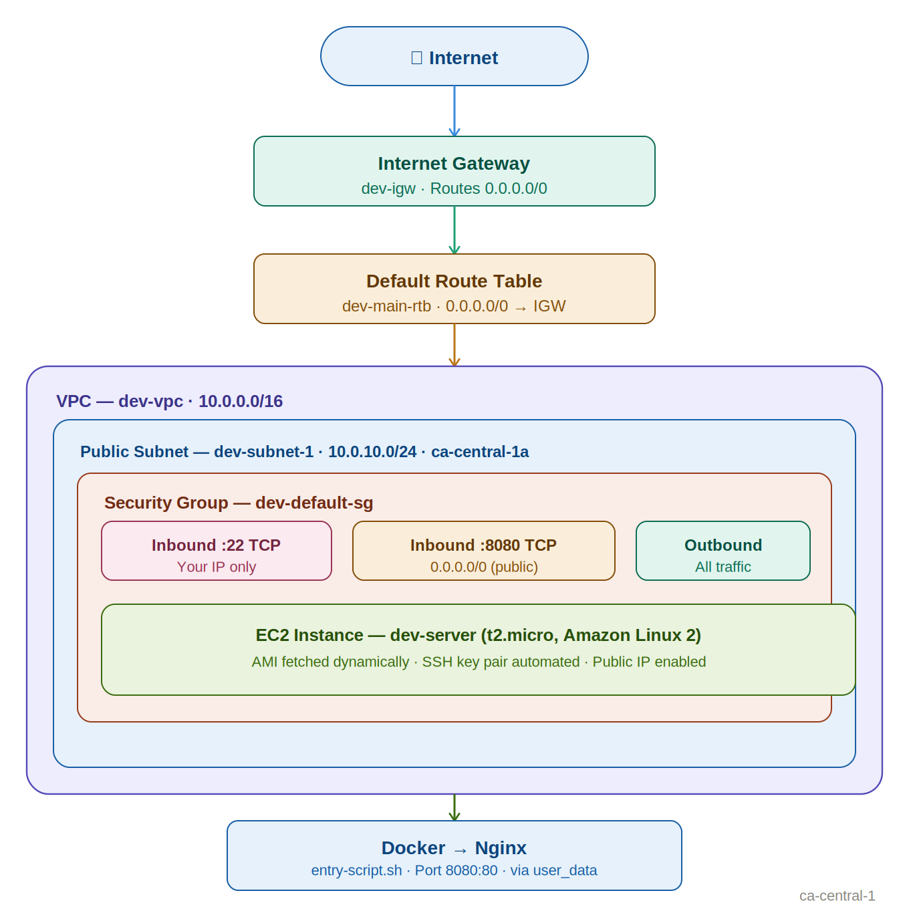
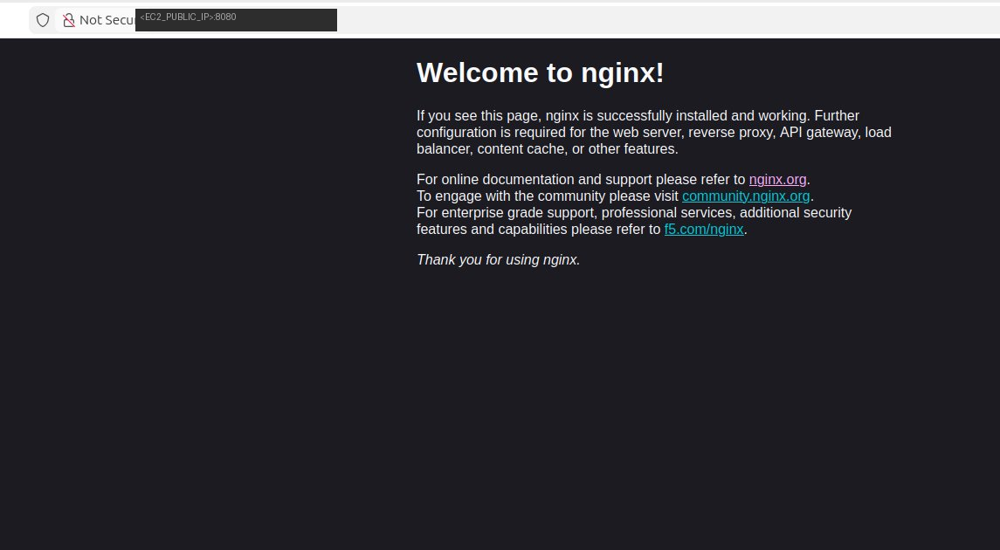

<div align="center">

# Terraform · AWS EC2 Deployment

**Provision a complete AWS network infrastructure and deploy a Dockerised Nginx server — fully automated with Terraform.**


</div>

---

## Table of Contents

- [Overview](#overview)
- [Architecture](#architecture)
- [Project Structure](#project-structure)
- [Prerequisites](#prerequisites)
- [Configuration](#configuration)
- [Getting Started](#getting-started)
- [Outputs](#outputs)
- [Accessing Nginx](#accessing-nginx)
- [Security Notes](#security-notes)

---

## Overview

This project is a practical Terraform demo that builds AWS cloud infrastructure from the ground up — no manual console clicks required. It covers the full lifecycle from networking to a live web server:

| Stage | What Was Built |
|---|---|
| **Networking** | Custom VPC, public subnet, Internet Gateway |
| **Routing** | Default Route Table configured for public internet access |
| **Security** | Default Security Group with locked-down SSH and open HTTP |
| **Compute** | EC2 instance (Amazon Linux 2) with dynamic AMI lookup |
| **Access** | Automated SSH key pair provisioning via Terraform |
| **Application** | Docker installed via user data; Nginx container running on port 8080 |

---

## Architecture


---

## Project Structure

```
.
├── main.tf               # All infrastructure resources
├── providers.tf          # Provider & version constraints
├── entry-script.sh       # EC2 user data: Docker + Nginx bootstrap
├── terraform.tfvars      # ⚠️  Local variable values — NOT committed
└── README.md
```

> `terraform.tfvars` is excluded from version control. See [Security Notes](#security-notes).

---

## Prerequisites

| Requirement | Version | Notes |
|---|---|---|
| [Terraform](https://developer.hashicorp.com/terraform/install) | ≥ 1.0 | Run `terraform -version` to verify |
| [AWS CLI](https://docs.aws.amazon.com/cli/latest/userguide/install-cliv2.html) | v2+ | Must be configured with valid credentials |
| SSH key pair | — | Generate with `ssh-keygen -t rsa -b 4096` |
| AWS account | — | Permissions for VPC, EC2, and Security Groups |

---

## Configuration

All variables are defined in `main.tf` and supplied via a local `terraform.tfvars` file.

| Variable | Description | Example |
|---|---|---|
| `vpc_cidr_blocks` | CIDR block for the VPC | `"10.0.0.0/16"` |
| `subnet_cidr_block` | CIDR block for the public subnet | `"10.0.10.0/24"` |
| `avail_zone` | AWS availability zone | `"ca-central-1a"` |
| `env_prefix` | Prefix applied to all resource name tags | `"dev"` |
| `my_ip` | Your public IP for SSH access (CIDR notation) | `"x.x.x.x/32"` |
| `instance_type` | EC2 instance type | `"t2.micro"` |
| `public_key_location` | Absolute path to your local SSH public key | `"/home/<YOUR_USERNAME>/.ssh/id_rsa.pub"` |

Create `terraform.tfvars` in the project root — **do not commit this file**:

```hcl
vpc_cidr_blocks      = "10.0.0.0/16"
subnet_cidr_block    = "10.0.10.0/24"
avail_zone           = "ca-central-1a"
env_prefix           = "dev"
my_ip                = "<YOUR_PUBLIC_IP>/32"
instance_type        = "t2.micro"
public_key_location  = "/home/<YOUR_USERNAME>/.ssh/id_rsa.pub"
```

### Provider Versions (`providers.tf`)

```hcl
terraform {
  required_providers {
    aws = {
      source  = "hashicorp/aws"
      version = "~> 6.0"
    }
    linode = {
      source  = "linode/linode"
      version = "3.9.0"
    }
  }
}
```

---

## Getting Started

**1. Clone the repository**

```bash
git clone https://github.com/<your-username>/<your-repo>.git
cd <your-repo>
```

**2. Add your `terraform.tfvars`**

See the [Configuration](#configuration) section above and fill in your own values.

**3. Initialise Terraform**

```bash
terraform init
```

**4. Review the execution plan**

```bash
terraform plan
```

**5. Apply the configuration**

```bash
terraform apply
```

> Allow ~2 minutes after apply for the EC2 user data script to install Docker and start Nginx.

**6. SSH into the instance**

```bash
ssh -i ~/.ssh/id_rsa ec2-user@<ec2_public_ip>
or
ssh ec2-user@<ec2_public_ip>
```

**7. Destroy all resources when done**

```bash
terraform destroy
```

> ⚠️ Always destroy resources after the demo to avoid unexpected AWS charges.

---

## Outputs

After a successful `terraform apply`, Terraform prints the following values:

| Output | Description |
|---|---|
| `aws_ami_id` | ID of the latest Amazon Linux 2 AMI fetched dynamically |
| `ec2_public_ip` | Public IP address of the deployed EC2 instance |

Example:

```
Outputs:
  aws_ami_id    = "ami-xxxxxxxxxxxxxxxxx"
  ec2_public_ip = "35.183.x.x"
```

---

## Accessing Nginx

Once the instance is running, open your browser and navigate to:

```
http://<ec2_public_ip>:8080

```


A successful deployment serves the **Welcome to nginx!** default page — confirming that Docker and Nginx are running inside the EC2 instance.

---

## Security Notes

- **`terraform.tfvars` is gitignored.** It contains your IP address and local filesystem paths. Ensure your `.gitignore` includes:

  ```gitignore
  terraform.tfvars
  *.pem
  ```

- **Restrict `.pem` key file permissions** immediately after download:

  ```bash
  chmod 400 your-key.pem
  ```

- **SSH access is locked to your IP only.** Port 22 is restricted to `var.my_ip` in the Security Group. Port 8080 is open to the public for the purposes of this demo — restrict this for any production workloads.

- **AMI is resolved dynamically** at apply time, always using the latest Amazon Linux 2 HVM x86_64 image from Amazon's official owners list.
